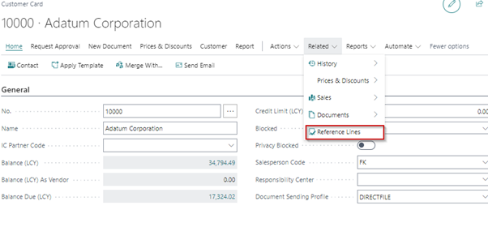
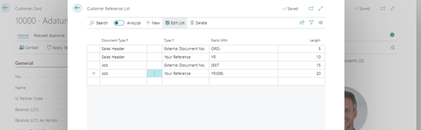
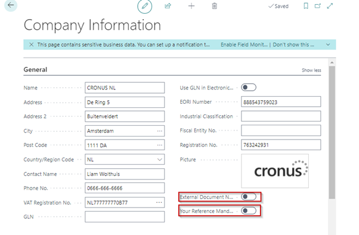

# Manual Customer Reference Validator
This manual describes how to set up and use the Customer Reference Validator app.

## Customer Reference Validator Setup

### Customer setup
On the Customer card you can set up different templates for different documents.

For each document you can set up different and or multiple templates.

### Company Information setup
On the Company Information page you can set up whether or not to make the External Document No. and or Your Reference mandatory on the Sales Quote, Sales Order, Sales Invoice and Job. 

[:arrow_left:](../README.md) [Back](../README.md)