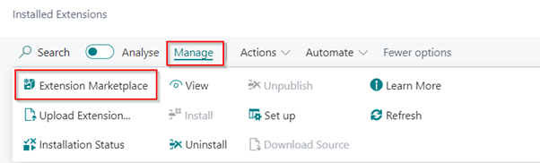

# Manual Customer Reference Validator
This manual describes how to set up and use the Customer Reference Validator app.

## Install and activate the app
The following procedure shows how to install the extension through the Extension Management page.
1.	Choose the Search icon, Enter Extension Management, and the choose the related link. 
2.	Choose from the menu the Extension Marketplace action.

    

3.	In the AppSource Apps for Business Central search for Customer Reference Validator.
4.	Select the App. 
5.	Select Get It Now. 
6.	Choose from the menu the Deployment Status action. 
7.	Check if the status is Complete.

[:arrow_left:](../README.md) [Back](../README.md)