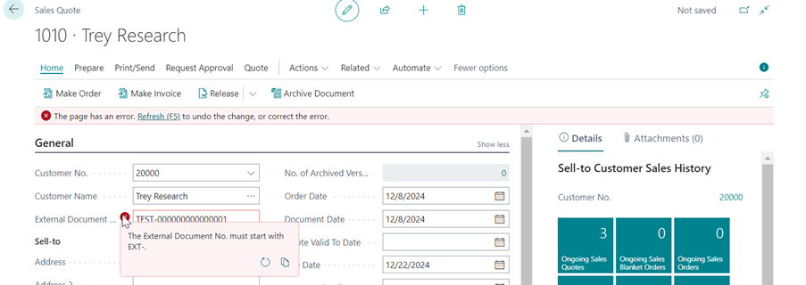

# Manual Customer Reference Validator
This manual describes how to set up and use the Customer Reference Validator app.

## Using the Customer Reference Validator

When using the Customer Reference Validator the created Reference Lines will be taken into account when filling the External Document No. and or Your Reference. In the example below there is a Customer Reference Line created for the External Document No. on the Sales Header. It must start with EXT- and must be exactly 20 characters long.

When creating a Sales Quote for this Customer the Reference Line will be taken into account when creating a Order from the Quote and a Invoice from Quote.

The error that is displayed shows that the External Document No. must be filled. That is because there is a Customer Reference Line for the selected Customer on this Document.

If the External Document No. is filled incorrectly, there are 3 errors that can occur. 

*The length of External Document No. is not correct. The value must be 20 character(s) long.*

This error occurs when there is only 1 Customer Reference Line for this field on this Document with this Customer. It tells the user what the field value needs to be length wise.

*The External Document No. must start with EXT-.*

This error occurs when there is only 1 Customer Reference Line for this field on this Document with this Customer and the field value is correct length wise. It tells the user what the field value needs to start with.

*The value of External Document No. does not match a Customer Reference Line.*

This error occurs when there are multiple Customer Reference Lines for the Customer on this document on this field. It therefore tells the user that it cannot find a Customer Reference Line that it can validate the value with.

[:arrow_left:](../README.md) [Back](../README.md)